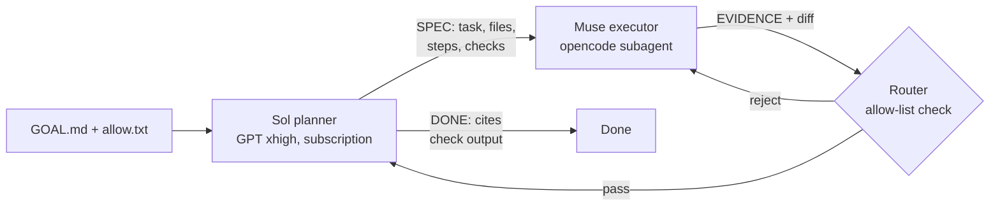

# sol-loop

[](LICENSE)


**Sol plans. Muse builds. You keep the 20 EUR subscription.**

GPT xhigh on your Codex subscription emits one atomic SPEC per turn. Muse Spark in opencode does all the reading, editing, and testing, then returns EVIDENCE. Sol decides the next step. Over 99 percent of tokens run on Muse.

```bash
git clone https://github.com/LucasDuys/sol-loop.git && ./sol-loop/install.sh
```

```bash
cd your-repo
sol-loop --goal GOAL.md --allow allow.txt
```

No auth needed to start: mock mode works immediately, live mode lights up after `codex auth login`. The installer links the skill plus both agents into opencode and puts `sol-loop` on your PATH.

---

## How it works



1. **Sol outputs `SPEC:`** with NEXT_TASK, FILES, STEPS, DONE_WHEN, FORBIDDEN. Or `QUESTION:`, `DONE:`, `BLOCKED:`, verbatim. Sol never sees your files, only goal plus evidence plus allow list.
2. **Muse executes inside FILES only** and returns `EVIDENCE:` with CHANGED, CHECKS, STATE, NEXT. Full harness: allow-list contract, skills on demand, MCP docs, browser verify.
3. **Router code enforces the boundary.** Diffs outside the allow list are rejected before they reach Sol. Nothing is DONE without raw command output. Summary prose does not count.

Contracts in [`SKILL.md`](SKILL.md) and [`references/scopes.md`](references/scopes.md). Prompts in [`agents/`](agents). Ported from the Kenward agent prompt standard: determinism beats instruction, pre-resolve before reasoning, every rule ships with an eval case.

---

## Measured results

**SWE-bench Verified starter slice: 2/2 officially resolved.** Real GitHub issues in `requests`, graded by the official Docker harness, not by our own checks. Two more real issues in `pytest` fixed and verified by fail to pass repro (official grading blocked on Apple Silicon Docker, documented). Same patches with and without the planner, at ~9 subscription units of planning per task and 0 EUR marginal.

| Harness | SWE-bench Verified (4 real issues) | Smoke slice (6 small tasks) | Sol cost / task |
|---|---|---|---|
| **sol-loop** (Sol SPEC, Muse builds) | **2/2 official**, 2 verified local | 6/6 | ~9 units, 0 EUR |
| muse-only (no planner) | 2/2 official, 2 verified local | 6/6 | 0 |
| sol-only (Sol builds directly) | not run (rate limits) | 1/1 valid, 5 rate limited | ~12 units |

Two readings. Accuracy is at parity because both Muse arms converged on identical patches: the loop's value here is process plus cost, a pinned SPEC, enforced scope, evidence trail, planning flat at ~9 units instead of ~12 plus units implementing directly. And 5 of 6 sol-only smoke runs died on the subscription usage limit while planner calls kept fitting: **on a flat sub the scarce resource is rate limit, not euros.** The accuracy gap, if any, shows on tasks the executor cannot solve unaided. That slice is next.

Money math: ~25% fewer subscription units on trivial tasks, modeled ~85% off metered API spend per mid size task (~$0.51 vs ~$0.07 at GPT-5.5 prices). Routing rules from the numbers: [`references/routing.md`](references/routing.md). Full math: [`evals/external/SAVINGS.md`](evals/external/SAVINGS.md).

<details>
<summary>Where each number comes from</summary>

- **Seed evals 6/6 shape.** `python3 scripts/bench.py --backend mock` scores the 6 contract cases in [`evals/cases/`](evals/cases) (happy path, ambiguity, permission, scale, multi step, injection). Table at the top of [`evals/BENCHMARKS.md`](evals/BENCHMARKS.md). No auth needed.
- **Smoke slice 6/6 both arms.** The 6 tasks are hand written in [`evals/external/polyglot-smoke.jsonl`](evals/external/polyglot-smoke.jsonl), each with goal, allow list, starter file, and a zero dependency check (`python3 check_*.py`, `node --experimental-strip-types check_*.ts`). Prepared with `evals/external/run_slice.py --harness sol-loop --backend codex` (live Sol SPECs, 6/6 shape pass, transcripts in `evals/external/runs/smoke-1/*/planner.log`) and `--harness muse-only` for the baseline. I executed all 12 task dirs, then graded with `run_slice.py --grade`. Per task rows in [`evals/external/RESULTS.md`](evals/external/RESULTS.md).
- **sol-only 1/1 valid, 5 invalid.** `run_slice.py --harness sol-only` runs `codex exec -s workspace-write` per task. One clean pass (29.3s, 12.2 units). The other five logs show `ERROR: You've hit your usage limit`, files untouched. Records marked invalid in `results.jsonl`, excluded from averages by `--compare`.
- **Live pilot SPEC to DONE.** One real task in `/tmp/sol-loop-demo`: Sol SPEC, Muse implement, Sol DONE citing check output. Codex reported 9.267 then 8.886 units, both 0 EUR marginal. Written up in [`evals/LIVE-PILOT.md`](evals/LIVE-PILOT.md).
- **SWE-bench Verified starter slice.** 4 instances in [`evals/external/swe-4.txt`](evals/external/swe-4.txt) (2 `requests`, 2 `pytest`), both arms executed by hand from first principles. Transcripts and patches in `evals/external/runs/swe-4/` and `swe-4-baseline/`. Official Docker reports in `evals/external/runs/official-reports/`. Section in [`evals/external/RESULTS.md`](evals/external/RESULTS.md).
- **Published context.** Sep 2026 leaderboard snapshots (SWE-bench Verified ~89 to 96% at the frontier, efficient scaffolds ~$0.67 to $1.77 per task) in [`evals/external/PUBLISHED.md`](evals/external/PUBLISHED.md). Harder slices (20 task Exercism, 10 task SWE-bench Verified) are wired in [`evals/external/`](evals/external).

</details>

---

## Use in opencode

```bash
cd your-repo
echo "Your goal in one paragraph" > GOAL.md
printf 'src/area/file-a.ts\nsrc/area/file-b.ts\n' > allow.txt
sol-loop --goal GOAL.md --allow allow.txt
```

The router calls Sol for a SPEC, then tells you to run the executor step. In the opencode TUI that step is `@muse-executor` with the SPEC contents. Re run `sol-loop` and Sol emits the next SPEC or `DONE:`.

No-auth demo:

```bash
SOL_BACKEND=mock sol-loop --goal GOAL.md --allow allow.txt
python3 sol-loop/scripts/bench.py --backend mock
```

---

## Why this exists

| Principle | Mechanism |
|---|---|
| Planning quality without API burn | Sol sees under 2k tokens per turn. Never the repo. |
| Executor quality without prompt bloat | Muse gets the harness: contract, skills, MCP, browser verify. |
| No silent scope creep | `check-allowlist.sh` rejects out of scope diffs in code. |
| No fake done | DONE requires raw command output plus git status. |

## Scopes

| Scope | Who | Can | Cannot |
|---|---|---|---|
| plan | Sol | read goal plus evidence, write SPEC | edit, shell, MCP, change goal |
| execute | Muse | edit allow listed files, run checks, write EVIDENCE | change scope, touch outside allow list |
| route | code | enforce allow list, budgets, traces | generate code, skip checks |
| owner | you | credentials, deploys, billing | never auto |
| verify | shared | defined check commands, headless browser | prod writes without flag |
| bench | harness | mock planner, scoring | needs no auth |

Full definitions: [`references/scopes.md`](references/scopes.md). What to send where: [`references/routing.md`](references/routing.md). Popular benchmark landscape: [`evals/external/LANDSCAPE.md`](evals/external/LANDSCAPE.md).

<details>
<summary>Repo layout</summary>

```
install.sh                 one command setup, links skill plus agents
SKILL.md                   skill entry, load bearing order
agents/sol-planner.md      planner prompt, no tools
agents/muse-executor.md    executor prompt, full tools
scripts/sol-loop           PATH entry point, calls run.sh
scripts/run.sh             router loop
scripts/mock-sol.sh        pre auth planner stand in
scripts/check-allowlist.sh L2 enforcement
scripts/bench.py           scoring plus BENCHMARKS.md writer
evals/cases/               one file per case, category mandatory
evals/BENCHMARKS.md        generated score table
evals/LIVE-PILOT.md        measured live run
evals/external/            benchmark adapters, slices, results
references/                scopes, routing, auth
```

</details>

## Roadmap

- [x] Mock loop plus seed evals, no auth needed
- [x] Live codex backend pilot with measured usage
- [x] Three arm comparison with cost split
- [x] 4 task SWE-bench Verified starter slice, 2/2 official
- [ ] 20 task Exercism slice through both arms
- [ ] 10 task SWE-bench Verified slice with official grading
- [ ] Nightly drift set from sampled traces

Built for opencode. Works with `codex-handoff` for owner credential steps.
